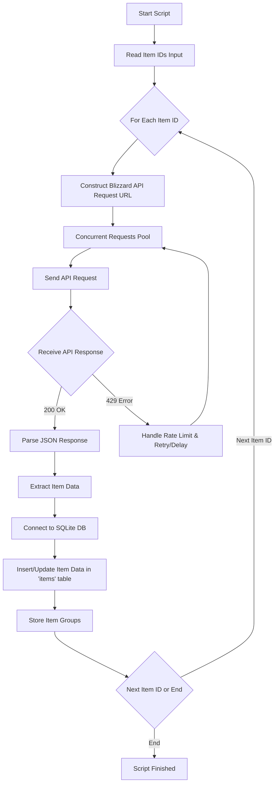

# Backend Documentation

## 1. Backend Framework and Language

* **Framework:** FastAPI (Python)
* **Language:** Python 3.x

**Rationale:** FastAPI is chosen for its high performance, asynchronous capabilities (essential for concurrent API requests), automatic data validation, and ease of use in building APIs with Python. Python is a widely adopted language with excellent libraries for API development and data handling.

## 2. Database

* **Database:** SQLite

**Rationale:** SQLite is a file-based database, ideal for personal projects and local data storage. It's simple to set up, requires no separate server, and is sufficient for the initial data volume and access patterns.  If the project scales significantly in the future, migrating to a more robust database like PostgreSQL is possible.

## 3. Database Schema

The database schema will consist of three tables to store item data and manage item groups:

### 3.1. `items` Table

| Column Name             | Data Type | Primary Key | Description                                  |
| ----------------------- | --------- | ----------- | -------------------------------------------- |
| `item_id`               | INTEGER   | YES         | Unique identifier for the item (Blizzard API ID) |
| `item_class_id`         | INTEGER   | NO          | ID of the item's class                       |
| `item_class_name`       | TEXT      | NO          | Name of the item's class                     |
| `item_subclass_id`      | INTEGER   | NO          | ID of the item's subclass                    |
| `item_subclass_name`    | TEXT      | NO          | Name of the item's subclass                  |
| `display_subclass_name` | TEXT      | NO          | Display name of the subclass (optional)      |
| `item_name`             | TEXT      | NO          | Name of the item                               |

### 3.2. `groups` Table

| Column Name  | Data Type | Primary Key | Description                               |
| ------------ | --------- | ----------- | ----------------------------------------- |
| `group_id`   | INTEGER   | YES (Auto-increment) | Unique identifier for the group             |
| `group_name` | TEXT      | NO (UNIQUE) | Name of the group (user-defined category) |

### 3.3. `item_groups` Table (Junction Table)

| Column Name | Data Type | Primary Key (Part of) | Foreign Key References | Description                               |
| ----------- | --------- | ------------------- | ---------------------- | ----------------------------------------- |
| `item_id`   | INTEGER   | YES                 | `items.item_id`        | Foreign key referencing the `items` table |
| `group_id`  | INTEGER   | YES                 | `groups.group_id`       | Foreign key referencing the `groups` table |

**Relationships:**

* **One-to-many:** `items` to `item_groups` (via `item_id`)
* **One-to-many:** `groups` to `item_groups` (via `group_id`)
* **Many-to-many:** `items` and `groups` (through `item_groups` junction table)

## 4. API Design (Initial Data Extraction Phase)

Initially, data extraction will be triggered manually via a Python script.  While not a formal API endpoint in this phase, the script will act as the data ingestion mechanism.

**Input:**

* The script will accept a comma-separated string of item IDs as input, either as a command-line argument or read from a file.

**Process:**

1. **Item ID Processing:** The script will parse the input string into a list of individual item IDs.
2. **Concurrent Blizzard API Requests:** For each item ID:
    * Construct the Blizzard API request URL to fetch item details (specifically class and subclass information). We will use the `/data/wow/item-class/index` and `/data/wow/item-class/{classId}` endpoints as shown in the examples you provided.
    * We will also need to use the `/data/wow/search/item` endpoint to retrieve the `item_name` based on `item_id`.
    * Make concurrent asynchronous requests to the Blizzard API using a concurrency limit (e.g., 20 concurrent requests).
3. **Data Extraction and Transformation:**
    * Parse the JSON responses from the Blizzard API.
    * Extract the `item_class_id`, `item_class_name`, `item_subclass_id`, `item_subclass_name`, `display_subclass_name` (if available), and `item_name`.
4. **Data Storage in SQLite:**
    * Connect to the SQLite database.
    * For each item, insert or update data in the `items` table. We will use `item_id` as the unique key.

## 5. Concurrency and Rate Limiting

* **Concurrency Level:** 20 concurrent requests to the Blizzard API.
* **Concurrency Control:**  Python's `asyncio.Semaphore` will be used to limit the number of concurrent requests.
* **Rate Limit Handling:**
  * Implement error handling to catch 429 "Too Many Requests" errors from the Blizzard API.
  * If a 429 error is encountered, implement a retry mechanism with exponential backoff to avoid overwhelming the API.  Alternatively, we can implement a simple delay after a certain number of requests to stay within the rate limits.

## 6. Data Extraction Process Flow

## 7. Future API (Serving Data to Website)

In the future, a RESTful API will be developed using FastAPI to serve the data stored in the SQLite database to a website. This API will include endpoints for:

* Retrieving items by ID, class, subclass, name, etc.
* Retrieving lists of item classes and subclasses.
* Retrieving items belonging to specific groups.
* Managing groups (creating, updating, deleting groups and assigning items to groups - this is a future feature).
