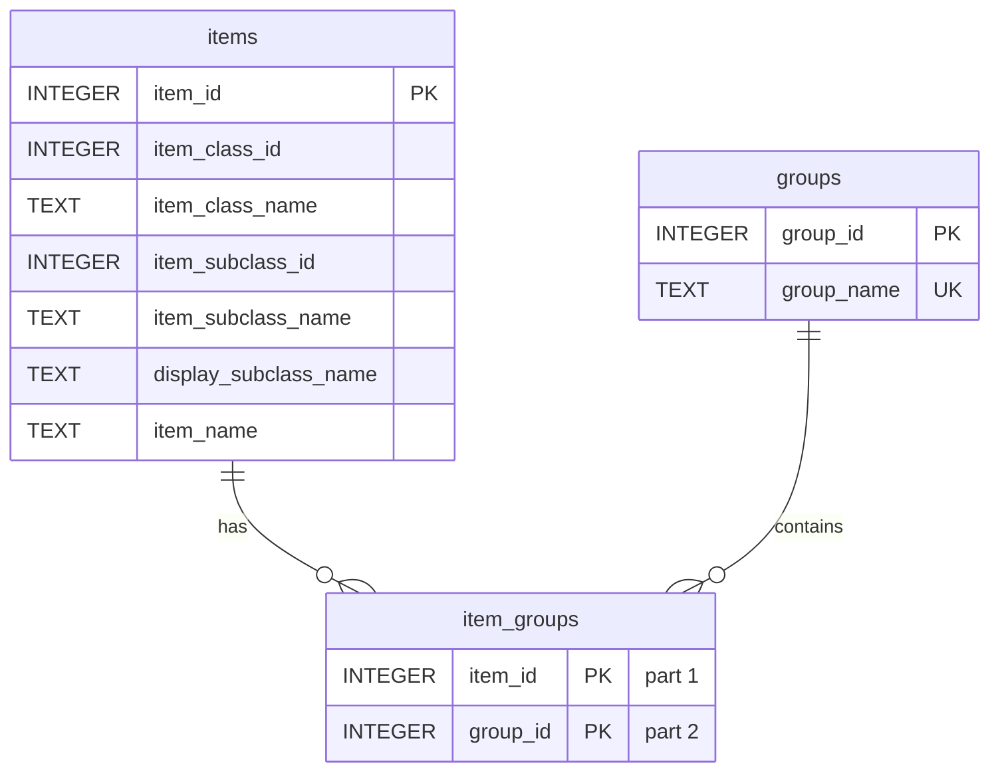

# Database Schema Documentation - Part 1: Introduction and Overview

## 1. Introduction

This document outlines the database schema for the Blizzard Item Data Extractor project. We are using SQLite as the database for its simplicity and file-based nature, which is well-suited for this personal project. The schema is designed to store item data extracted from the Blizzard API, categorize items by class and subclass, and allow for user-defined groupings of items.

## 2. Schema Overview

The database schema consists of three tables:

* **`items`**: Stores core item information fetched from the Blizzard API, including item ID, class, subclass, and name.
* **`groups`**: Stores user-defined item groups or categories.
* **`item_groups`**: A junction table establishing a many-to-many relationship between `items` and `groups`, indicating which items belong to which groups.

## 3. Detailed Table Schemas

### 3.1. `items` Table

**Purpose:** Stores detailed information about game items, extracted from the Blizzard API.

| Column Name             | Data Type | Constraints    | Description                                                                 |
| ----------------------- | --------- | -------------- | --------------------------------------------------------------------------- |
| `item_id`               | INTEGER   | PRIMARY KEY    | Unique identifier for the item, as provided by the Blizzard API.             |
| `item_class_id`         | INTEGER   |                | ID of the item's class, corresponding to Blizzard API item class IDs.        |
| `item_class_name`       | TEXT      |                | Name of the item's class (e.g., "Weapon", "Armor").                          |
| `item_subclass_id`      | INTEGER   |                | ID of the item's subclass, within its class.                                |
| `item_subclass_name`    | TEXT      |                | Name of the item's subclass (e.g., "Swords", "Plate").                        |
| `display_subclass_name` | TEXT      |                | Display name for the subclass, as presented in the Blizzard API (optional). |
| `item_name`             | TEXT      |                | Name of the item.                                                            |
| `extension`             | TEXT      |                | User-defined item category extension (local field not from Blizzard API)     |

### 3.2. `groups` Table

**Purpose:** Stores user-defined groups or categories for organizing items.

| Column Name  | Data Type | Constraints        | Description                                                              |
| ------------ | --------- | ------------------ | ------------------------------------------------------------------------ |
| `group_id`   | INTEGER   | PRIMARY KEY, AUTOINCREMENT | Unique, automatically incrementing ID for each group.                       |
| `group_name` | TEXT      | UNIQUE, NOT NULL     | Name of the group (e.g., "Legendary Weapons", "Starter Gear"). Must be unique. |

### 3.3. `item_groups` Table

**Purpose:** Junction table to manage the many-to-many relationship between `items` and `groups`. It links items to the groups they belong to.

| Column Name | Data Type | Constraints                     | Foreign Key References | Description                                                                 |
| ----------- | --------- | ------------------------------- | ---------------------- | --------------------------------------------------------------------------- |
| `item_id`   | INTEGER   | PRIMARY KEY (Part of), NOT NULL | `items.item_id`        | Foreign key referencing the `item_id` in the `items` table.                |
| `group_id`  | INTEGER   | PRIMARY KEY (Part of), NOT NULL | `groups.group_id`       | Foreign key referencing the `group_id` in the `groups` table.               |

**Primary Key Constraint:** The combination of `item_id` and `group_id` as the primary key ensures that each item-group association is unique and prevents duplicate entries in this junction table.

## 4. Relationships

* **Many-to-Many Relationship between `items` and `groups`:**  An item can belong to multiple groups, and a group can contain multiple items. This relationship is implemented through the `item_groups` junction table.
* **One-to-Many from `items` to `item_groups`:**  Each item can have multiple entries in the `item_groups` table, representing its membership in different groups.
* **One-to-Many from `groups` to `item_groups`:** Each group can have multiple entries in the `item_groups` table, listing all the items that belong to it.

## 5. Data Type Rationale

* **INTEGER:** Used for IDs and foreign keys, as these are numerical identifiers.
* **TEXT:** Used for names and descriptions, allowing for variable-length string data.

## 6. Indexing (Initial Considerations)

For initial performance, especially when querying items by their IDs, SQLite automatically creates an index on primary key columns.  For future optimization, consider adding indexes on:

* `item_class_id` and `item_subclass_id` in the `items` table if you plan to frequently query or filter items by class or subclass.
* `group_name` in the `groups` table if you anticipate frequent lookups of groups by name (though the UNIQUE constraint might already create an index in SQLite).

However, for a SQLite database in a personal project, extensive manual indexing might not be necessary unless performance becomes a noticeable issue.

## 7. Migrations (Future Consideration)

For schema evolution in the future, especially if you decide to use a more complex database system or anticipate frequent schema changes, consider using a database migration tool (like Alembic for Python with SQLAlchemy). However, for SQLite and the expected scope of this project, manual schema adjustments might be sufficient for now.
